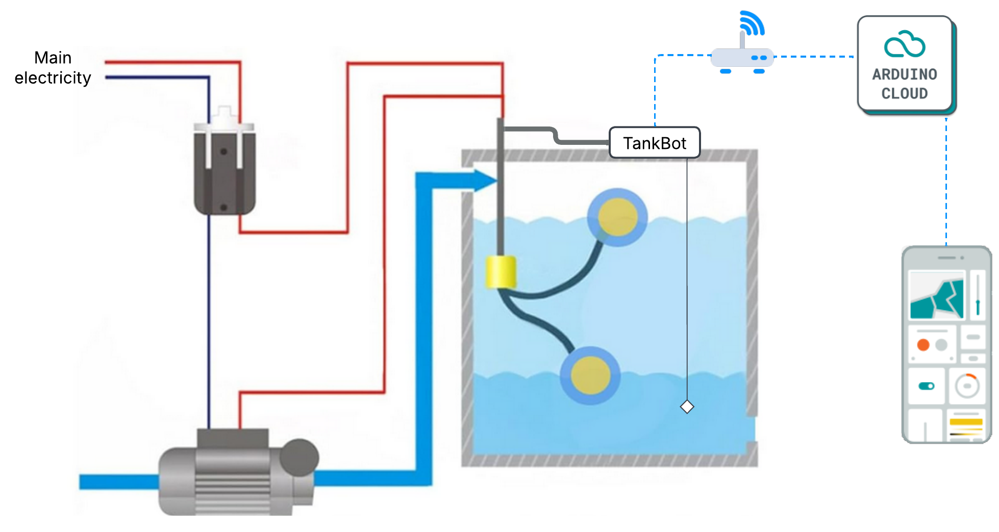
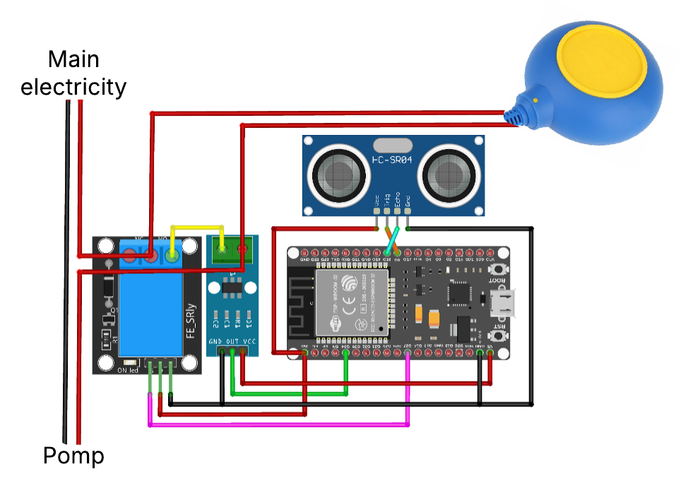

# **🚀 TankBot - Smart Liquid Tank Management System**  

TankBot is an **intelligent monitoring and control system** for liquid tanks. It tracks **liquid levels**, manages flow, optimizes energy consumption, and supports **programmable schedules**. Designed for **IoT integration**, it ensures **efficient and automated** tank management.  

---

## **📌 Features**
- **🔍 Real-time Monitoring** – Measures liquid level, volume, and fill percentage.  
- **⚡ Automated Control** – Manages the pump to maintain optimal levels.  
- **🌐 IoT Integration** – Syncs with **Arduino Cloud** for remote monitoring & control.  
- **📊 Energy Optimization** – Reduces consumption with programmable fill schedules.  
- **📱 Mobile/Web Interface** – View tank status and control operations remotely.  

---

## **📸 System Architecture**
### **High-Level Overview**
  

### **Circuit Schematic**
  

---

## **⚙️ Hardware Components**
- **ESP32-WROOM-32** (WiFi-enabled microcontroller)  
- **Ultrasonic Sensor (HC-SR04)** (for liquid level measurement)  
- **Relay Module** (to control the pump)  
- **Float Switch** (for backup level detection)  
- **Power Supply** (for ESP32 and pump control)  

---

## **🛠 Installation & Setup**
### **Step 1: Gather Required Components**  
Ensure you have all the necessary hardware components listed above.  

### **Step 2: Assemble the Circuit**  
Connect all components according to the provided **schematic diagram** (`docs/schematic.png`).  

### **Step 3: Load the Code onto ESP32**  
1. Install **Arduino IDE** and required libraries:  
   - `ArduinoIoTCloud`
   - `WiFiClientSecure`
   - `Arduino_ConnectionHandler`  
2. Open `tankBot.ino` in **Arduino IDE**.  
3. Add your **WiFi credentials** and **Arduino Cloud secrets** in `secrets.h`.  
4. Upload the sketch to your **ESP32**.  

---

## **📂 Project Structure**
```
.
├── docs/                    
│   ├── arch.png              # System architecture diagram
│   ├── schematic.png         # Circuit schematic
│   ├── tankLiquidLevelling.png # Tank level measurement diagram
│
├── tankBot.ino               # Main Arduino sketch
├── README.md                 # This documentation
└── thingProperties.h         # Arduino Cloud properties
```

---

## **📝 Code Overview**
### **🔹 tankBot.ino**
Handles:  
- Ultrasonic **liquid level measurement**  
- **Pump control** logic  
- Cloud synchronization with **Arduino IoT Cloud**  

### **🔹 thingProperties.h**
Defines:  
- **Cloud variables** (`tankFillPercentage`, `tankIsFilling`, `tankVolumeLiters`, etc.)  
- IoT **WiFi connection settings**  

---

## **📡 IoT Cloud Integration**
TankBot syncs with **Arduino Cloud**, allowing remote monitoring & control via a **mobile app or web dashboard**.  

### **🌍 Data Sent to Cloud**
- **Liquid Level Height** (cm)  
- **Fill Percentage** (%)  
- **Tank Volume** (Liters / Cubic Meters)  
- **Pump Status** (ON/OFF)  

### **🛠 Remote Control**
- **Start/Stop Tank Filling** ✅  
- **Set Fill Thresholds** 🛑  
- **View Tank Status in Real-time** 📊  

---

## **📌 Future Improvements**
✅ **Machine Learning for Predictive Analysis** (detect abnormal fill patterns)  
✅ **Adaptive Scheduling** (based on weather or electricity tariffs)  
✅ **Battery-Powered Backup System** (for critical tank monitoring)  

---

## **📝 Contributing**
Feel free to **fork** this repository, **submit pull requests**, or **open issues** for improvements.  